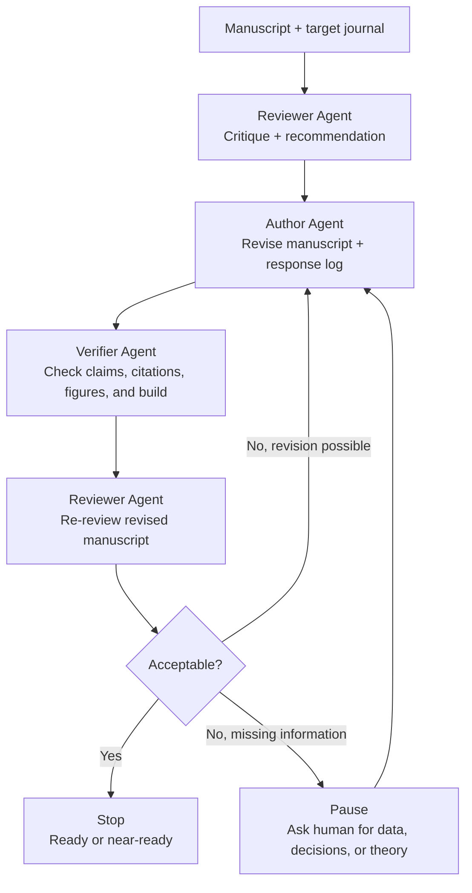

# Reviewer-Author Loop Skill

An iterative manuscript improvement skill for virtual peer review, author revision, verification, and re-review.

The workflow treats manuscript improvement as a closed loop:

1. A reviewer agent critiques the paper and gives a decision-oriented recommendation.
2. An author agent revises the manuscript and records how comments were addressed.
3. A verifier agent checks that the revision resolves the comments without creating new problems.
4. The reviewer re-reviews the revised manuscript.
5. The loop stops when the paper is acceptable or pauses when human input is required.

The pause condition is central: the skill should stop and ask the researcher when progress requires new data, experiments, simulations, images, datasets, theory, modeling, confidential decisions, or author judgment.

By default, the skill should not stop after the first review report. Unless the user asks for review-only output, it should complete at least one full cycle: review, revise, verify, and re-review.

## Workflow



## Install

Install directly from GitHub:

```bash
codex skills install github:hanhuark/reviewer-author-loop-skill
```

Or copy the skill folder into your Codex skills directory:

```bash
mkdir -p ~/.codex/skills
cp -R skills/reviewer-author-loop ~/.codex/skills/
```

## Included Skill

- `skills/reviewer-author-loop/`: reviewer-author-verifier workflow for manuscript revision.

## Command

- `/reviewer-author-loop:reviewer-author-loop`

Example prompt:

```text
Use the reviewer-author-loop skill on this manuscript. Act first as a reviewer, then revise as the author, verify the changes, and continue until the manuscript is acceptable or human input is needed.
```

## Companion Skills

This skill is designed as a process scaffold. It can cite or coordinate with other skills when available:

- `academic-paper-reviewer` for independent peer-review style critique.
- `academic-paper` for manuscript structure and prose revision.
- `deep-research` for targeted literature checks.
- `mechanical-engineering-research` or another domain skill for field-specific judgment.
- `documents:documents` for DOCX editing and rendering.
- `spreadsheets:Spreadsheets` for data tables and analysis.
- `zotero:Zotero` for reference management.

## Confidentiality

Private manuscripts, reviewer reports, unpublished data, grant proposals, and confidential comments should only be used for the current task. Do not copy private text into reusable examples, public repositories, or skill files. Convert lessons from private materials into abstract process rules with no identifiable titles, names, manuscript IDs, wording, or facts.

## License

MIT
