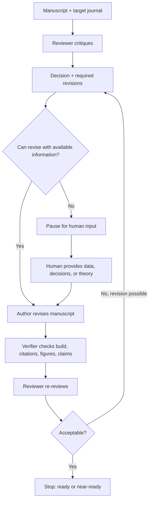

# Reviewer-Author Loop

## Purpose

Use this skill to run a closed-loop manuscript improvement process:

1. A **Reviewer Agent** evaluates the manuscript as a skeptical but constructive peer reviewer.
2. An **Author Agent** revises the manuscript and response plan to address the review.
3. A **Verifier Agent** checks that the revision actually resolves the comments and does not introduce new problems.
4. The loop repeats until the reviewer recommends acceptance or the author/verifier reaches a pause condition requiring human input.

This skill is distinct from one-pass peer review. Its value is the revision loop, traceable comment resolution, and explicit stop/pause decision.

## Confidentiality

If private manuscripts, reviewer reports, review archives, unpublished data, grant proposals, or confidential comments are provided, use them only for the current task. Do not copy private text into reusable skill files, public outputs, examples, or repositories. When extracting lessons from private materials, convert them into abstract process rules with no titles, author names, manuscript identifiers, wording, or identifiable facts.

## When To Use

Use this skill when the user asks to:

- simulate peer review and then revise the manuscript
- alternate between reviewer and author roles
- improve a paper until it is acceptable
- prepare a response to reviewers or rebuttal
- decide whether reviewer comments require new data, experiments, modeling, theory, or human judgment
- re-review a revised manuscript after changes
- audit whether author revisions truly addressed reviewer concerns

If the manuscript is in a specific technical field and a domain skill is available, use this skill as the process scaffold and the domain skill as the judgment layer.

## Inputs To Identify

Before starting, identify what is available:

- manuscript source: DOCX, PDF, LaTeX, Markdown, Overleaf folder, or plain text
- target journal, conference, thesis committee, or funding program
- current stage: pre-submission, revision, resubmission, internal review, final polish
- existing reviewer comments or simulated review needed
- editable source file and build/render method
- user constraints: maximum loop count, acceptable aggressiveness, whether to edit files directly

Proceed with reasonable assumptions when the missing information is not blocking. Pause only when the missing information changes the revision path.

## Loop Protocol

### 1. Reviewer Agent

Read the current manuscript and produce a decision-oriented review:

- recommendation: accept, minor revision, major revision, reject, or human input required
- core contribution and journal fit
- major comments that affect validity, novelty, methods, interpretation, or evidence
- minor comments that affect clarity, formatting, citations, or presentation
- required evidence or analysis
- acceptance criteria: what must change before the reviewer would recommend acceptance

Use `references/reviewer-rubric.md` for detailed review dimensions.

### 2. Author Agent

Convert reviewer comments into revisions:

- map each reviewer concern to a concrete action
- revise the manuscript, figures, tables, equations, references, and captions when possible
- add caveats or limitations when a claim cannot be fully supported
- avoid performative agreement: do not weaken or remove a claim if stronger evidence can support it
- preserve a response log with comment, action, manuscript location, and residual risk

Use `references/author-revision-protocol.md` for revision strategy and response-log structure.

### 3. Verifier Agent

Check the revision before returning to review:

- build/render the manuscript when possible
- verify citations, references, figures, tables, equation numbering, and cross-references
- check that every reviewer concern is addressed or explicitly marked unresolved
- check that new text does not overclaim, contradict earlier sections, or introduce unsupported statements
- check that figures/captions remain readable and aligned with the discussion

If editing files, do not claim completion until verification has been run or the inability to run it is reported.

### 4. Re-Reviewer Agent

Re-review the revised manuscript against the previous acceptance criteria:

- accepted or acceptable after editorial polish
- minor revision remains
- major revision remains
- human input required

If more revisions are possible with available information, loop back to the Author Agent. If not, pause.

## Stop And Pause Rules

Stop when the reviewer recommendation is:

- accept
- accept after minor editorial revision
- ready for submission with only user-preference edits remaining

Pause and ask the user when progress requires:

- new experiments, simulations, datasets, images, measurements, or raw files
- an author decision on scope, claims, novelty, or target journal
- domain knowledge not present in the manuscript or available sources
- a new theory/model that cannot be responsibly invented from current evidence
- confidential permissions or coauthor judgment
- choosing among mutually exclusive revision strategies

Use `references/pause-criteria.md` to classify pause conditions and phrase the user request.

## Output Format

During the loop, keep outputs concise and actionable:

- **Reviewer Decision**
- **Required Revisions**
- **Author Actions Taken**
- **Verification**
- **Remaining Risks**
- **Next Loop Decision**

When the loop stops, provide:

- final recommendation
- files changed
- verification performed
- unresolved risks or optional polish items

## Coordination With Other Skills

In the manuscript workflow that motivated this skill, the reviewer-author loop acted as the process scaffold while other skills supplied specialist judgment or file operations.

When acting as the **Reviewer Agent**, use and cite companion skills as applicable:

- `academic-paper-reviewer`: independent peer-review stance, editorial recommendation, major/minor comments, re-review after revision.
- `mechanical-engineering-research`: domain-specific technical review for thermal-fluid physics, boiling/heat-transfer models, experimental design, uncertainty, equations, figures, and interpretation.
- `deep-research`: targeted literature checks when a review comment depends on current or unfamiliar literature.

When acting as the **Author Agent**, use and cite companion skills as applicable:

- `academic-paper`: manuscript restructuring, abstract/introduction/discussion revision, response-to-reviewer style writing, and paper-level coherence.
- `mechanical-engineering-research`: technical rewriting, mechanistic framing, model explanation, analysis design, and engineering interpretation.
- `documents:documents`: DOCX editing, rendering, visual QA, comments, and tracked document artifact work.
- `spreadsheets:Spreadsheets`: spreadsheet inspection, data extraction, recalculation, and analysis tables.
- `zotero:Zotero`: citation lookup, BibTeX export, reference cleanup, and citation-key insertion when Zotero or BibTeX is used.
- `presentations:Presentations`: figure or slide-deck integration when manuscript figures are being adapted from presentation material.

For one-pass critique only, a peer-review skill is sufficient. Use this skill when the user wants iterative review, revision, verification, and re-review. In outputs, name the companion skills used for each loop stage so the workflow remains auditable.

## Minimal Flow

